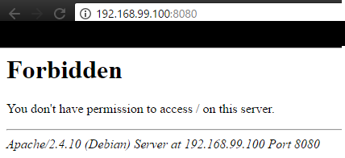
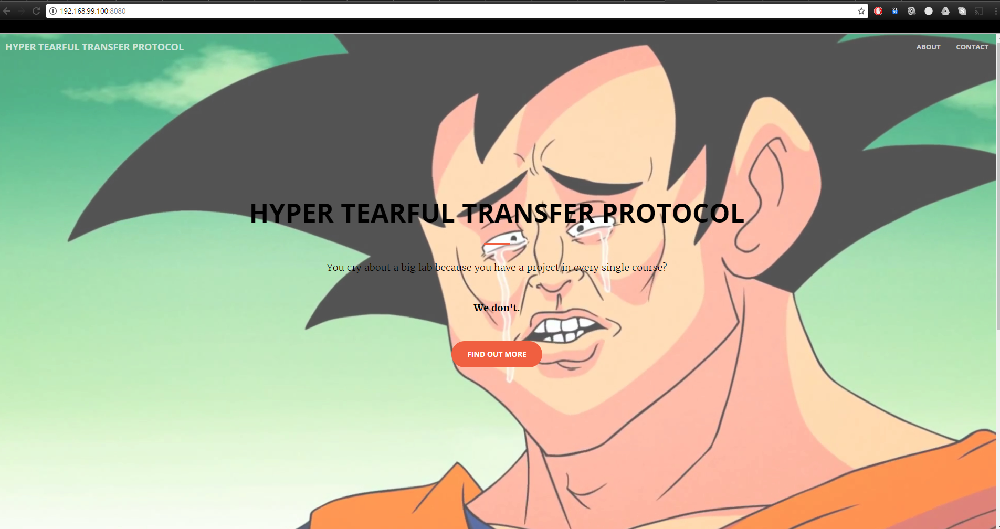

# Step 1: Static HTTP server with apache httpd

# Introduction
In this step, we will setup a static apache httpd server and run it into a Docker image. The goal is to have a nice looking site (using bootstrap templates) which we can access through a web browser and serving static content.

## Configuring our apache image
We chosed the [php 7.1.5 apache](https://github.com/docker-library/php/blob/c48c629568bc166b58b271114d0b44ea6d5cfa09/7.1/apache/Dockerfile) for our base image. It packs all the tools we need for our static httpd server (file system already configured, php installed, ...).

## Writing the Dockerfile
As we are using an almost ready-to-go image, there wasn't a lot to do in the Dockerfile.

```
FROM php:7.1.5-apache

# Copy the content of the folder src, the folder containing our contents for the site, into /var/www/html which is the default folder for the http contents in the image.
COPY src/ /var/www/html
```

## Adding the contents to the image
We now have an almost ready image. We have to put the static content into it to be able to display our site in the browser.  
Here is the result if we run a container with the image as it is now.
```
docker run -p 8080:80 -it res/static_httpd
```



For our content, we chosed the [Creative](https://startbootstrap.com/template-overviews/creative/) bootstrap template. We modified it a bit to be more personal (`index.html`) and it was ready to go. As we saw in the `Dockerfile`, the content should go on the src/ folder in our machine to be transfered to the docker image.  

## Testing the site with a browser
Our static appache httpd server is now ready to be tested with a web browser. We used *Chrome* and *Mozilla Firefox* to test it.


