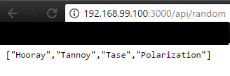

# Step 2: Dynamic HTTP server with express.js
In this step we will setup a HTTP sever in **NodeJS** using the **express.js** node module.

## The Docker image
We will use the [node:alpine](https://github.com/nodejs/docker-node/blob/a8eef541ef29ae81f53f0fdd177ec20bbead3ed2/8.1/alpine/Dockerfile) image for this step.
The Dockerfile is pretty simple since we won't need any special configuration other than our files (server.js and app.js).
```
FROM node:alpine

COPY src /opt/app

CMD ["node", "/opt/app/server.js"]
```

It will execute our `server.js` when the container start.

## Server.js
The main purpose of this step is to serve a dynamic content to the user when asked to. It should be a JSON containing some random datas chosen by us.
We have coded a server in NodeJS using the express node module. For the datas, it sends a JSON payload containing four words wich first letters form the acronym *HTTP*. It listens on the port **3000**.
The payload can be accessed on at the `/api/random` path.  


We also developped a small app.js to test it with a button.
