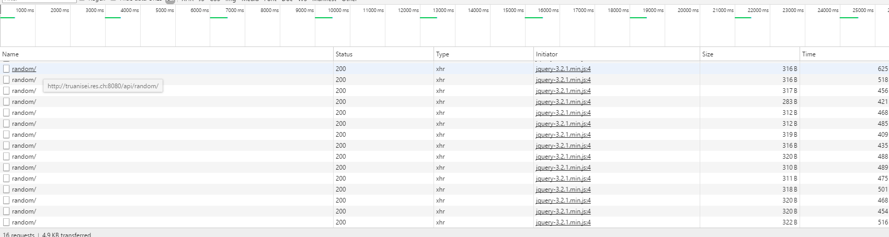
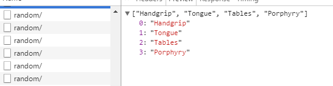

# Step 4: AJAX requests with JQuery
This step purpose is to link our static and dynamic content. We will use AJAX requests with JQuery to do so. It will refresh dynamicaly the static content with the payload received from the dynamic at a fixed rate. In our case, the big text will change with different words forming the *HTTP* acronym.
We will use a script in **NodeJS** to retrieve the payload and to change the element in the static content with our datas. It will use the **JQuery** library.

## Changing the index.html in the static server
We started by changing the `index.html` file in our static server developped in step 1. First we have to identify the element we want to be refreshed with the dynamic content. To do s, we used the developper tools offere by **Google Chrome**.


We found the id: `homeHeading`.

We now have to add our script into the `index.html` file. Our script is called `ajax.js` and is at the same level as `index.html`.

```
...

<!-- Generate the HTTP acronym -->
<script src="ajax.js"></script>
```

## Developping the script with JQuery
The purpose of the script is to retrieve the JSON from our dynamic server container and to change the element previously found.
To do so we use the **JQuery** library. It allows us to modify an element of the html file inside a script.

``` javascript
$(function() {
    function getAcronym() {
        $.getJSON("/api/random/", function( acronym ) {
            var message = "";
            message = acronym[0] + " " + acronym[1] + " " + acronym[2] + " " + acronym[3];

            $("#homeHeading").text(message).css('color', 'black');;
        });
    };

    setInterval(getAcronym, 3000);

});
```

First we `$.getJSON(/api/random/, ...)` to retrieve our JSON payload containing the words.

Then we create a message wth the four words. Finally the `$("#homeHeading")...` is where we get our element and modifiy it with our text. The # means we want retrieve it by id (which is homeHeading in our case).

## Testing
We now have a fully operating reverse proxy and a static frontend wich is updated with the datas from the dynamic backend.
We





We see the AJAX request made by the browser and the content of one of them.
And here is the result (sadly we couldn't put a gif to show it).

