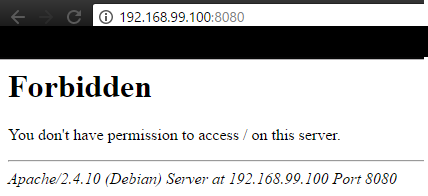
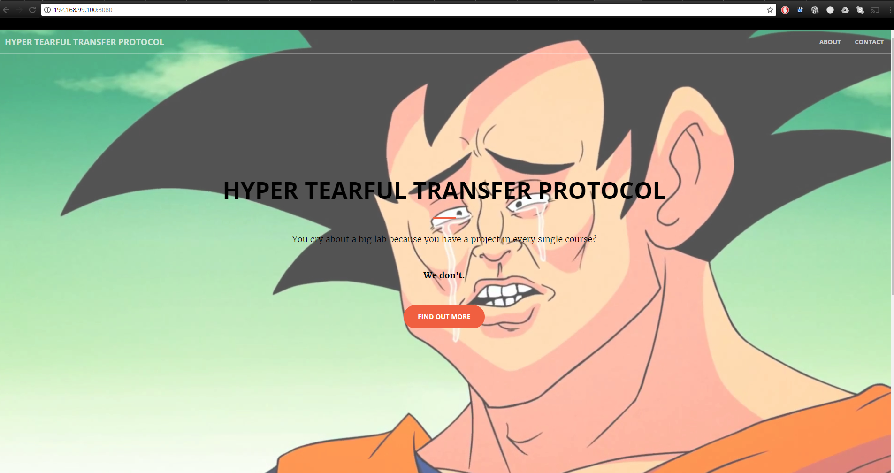
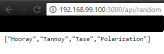
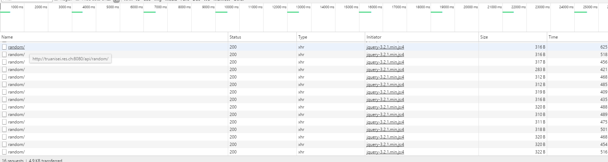
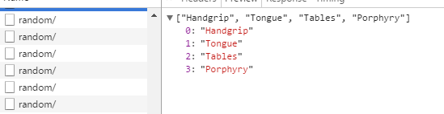

# Hyper Tearful Transfer Protocol

## Introduction
For the 5th RES lab, we were asked to get familiar with the HTTP protocol and infrastructure through several tasks.

This repository contains our solutions to the specifications given [here](https://github.com/SoftEng-HEIGVD/Teaching-HEIGVD-RES-2017-Labo-HTTPInfra).
It is composed of folders and files, which are:
- `docker/`: contains all docker images needed for this lab assignment.
- `docker_ui/`: contains a management UI for Docker.
- `images/`: contains figures used in this report.
- `scripts/`: scripts used by `start.sh`. They MUST NOT be executed directly.
- `start.sh`: script used to easily launch containers for each step.

## Step 1: Static HTTP server with apache httpd

In this step, we will setup a static Apache httpd server and run it into a Docker image. The goal is to have a nice looking site (using bootstrap templates) which we can access through a web browser and serving static content.

Files can be found [here](docker/static_http).

### Configuration
We chose [php:apache](https://hub.docker.com/_/php/) as our base image. It packs all the tools we need for our static httpd server (file system already configured, php and apache installed, ...).

### Dockerfile
As we are using an almost ready-to-go image so there wasn't a lot to do in the Dockerfile.

```
FROM php:apache

# Traefik configuration
LABEL "traefik.backend"="httpnode"
LABEL "traefik.backend.loadbalancer.sticky"="false"
LABEL "traefik.frontend.rule"="PathPrefix: /"
LABEL "traefik.port"="80"

COPY src /var/www/html
```

Don't mind *Traefik configuration* for now, it will be used later for additional steps.

As you can see, we simply copy the folder containing

### Adding the contents to the image
We now have an almost ready image. We have to put the static content into it to be able to display our site in the browser.  
Here is the result if we run a container with the image as it is now.
```
docker run -p 8080:80 -it res/static_httpd
```



For our content, we chosed the [Creative](https://startbootstrap.com/template-overviews/creative/) bootstrap template. We modified it a bit to be more personal (`index.html`) and it was ready to go. As we saw in the `Dockerfile`, the content should go on the src/ folder in our machine to be transfered to the docker image.  

### Testing the site with a browser
Our static appache httpd server is now ready to be tested with a web browser. We used *Chrome* and *Mozilla Firefox* to test it.



## Step 2: Dynamic HTTP server with express.js
In this step we will setup a HTTP sever in **NodeJS** using the **express.js** node module.

### The Docker image
We will use the [node:alpine](https://github.com/nodejs/docker-node/blob/a8eef541ef29ae81f53f0fdd177ec20bbead3ed2/8.1/alpine/Dockerfile) image for this step.
The Dockerfile is pretty simple since we won't need any special configuration other than our files (server.js and app.js).
```
FROM node:alpine

COPY src /opt/app

CMD ["node", "/opt/app/server.js"]
```

It will execute our `server.js` when the container start.

### Server.js
The main purpose of this step is to serve a dynamic content to the user when asked to. It should be a JSON containing some random datas chosen by us.
We have coded a server in NodeJS using the express node module. For the datas, it sends a JSON payload containing four words wich first letters form the acronym *HTTP*. It listens on the port **3000**.
The payload can be accessed on at the `/api/random` path.  


We also developped a small app.js to test it with a button.


## Step 3: Reverse proxy with apache (static configuration)
In this step, we will configure a php apache to be used as a reverse proxy to serve our both server (static and dynamic) developped in the steps 1 and 2.
The purpose of a reverse proxy is to offer one entry point for multiple path and IP. In our case it will be a running container and the only one accessible outside of the Docker machine. Our static and dynamic servers will be running too but we don't want them to be accessed directly. So we will connect to the reverse proxy and it will serve us the content we want from the other containers.

### The Docker image
In this step the docker image will need a little bit more configuration than the previous ones. In cause is the fact that we need to add our configuration files (where the virtual host is described) and enable theses configurations.

```
FROM php:7.1.5-apache

COPY conf/ /etc/apache2/sites-available/

RUN a2enmod proxy proxy_http
RUN a2ensite 000-* 001-*
```

We want to copy our files which are in the conf/ folder into the /etc/apache2/sites-available/ folder in the container.

```
<VirtualHost *:80>

ServerName truanisei.res.ch

ProxyPass "/api/random/" "http://172.17.0.3:3000/api/random/"
ProxyPassReverse "/api/random/" "http://172.17.0.3:3000/api/random/"


ProxyPass "/" "http://172.17.0.2:80/"
ProxyPassReverse "/" "http://172.17.0.2:80/"


</VirtualHost>
```

We use the ProxyPass and ProxyPassReverse to do so. It should go from the more specific to the more general (in our case `/api/random` is before `/`). It tells the container running as a reverse proxy which container should respond when a certain URL is asked. The weak point of a static configuration like this, is that we have to know the IP of the containers and they should always be the same as the ones configured. It means we have to launch the containers in a precise order and check if the docker machine set their IP corresponding with our conf.
We also modified the `000-default.conf` to redirect wrong path.


## Step 4: AJAX requests with JQuery
This step purpose is to link our static and dynamic content. We will use AJAX requests with JQuery to do so. It will refresh dynamicaly the static content with the payload received from the dynamic at a fixed rate. In our case, the big text will change with different words forming the *HTTP* acronym.
We will use a script in **NodeJS** to retrieve the payload and to change the element in the static content with our datas. It will use the **JQuery** library.

### Changing the index.html in the static server
We started by changing the `index.html` file in our static server developped in step 1. First we have to identify the element we want to be refreshed with the dynamic content. To do s, we used the developper tools offere by **Google Chrome**.


We found the id: `homeHeading`.

We now have to add our script into the `index.html` file. Our script is called `ajax.js` and is at the same level as `index.html`.

```
...

<!-- Generate the HTTP acronym -->
<script src="ajax.js"></script>
```

### Developping the script with JQuery
The purpose of the script is to retrieve the JSON from our dynamic server container and to change the element previously found.
To do so we use the **JQuery** library. It allows us to modify an element of the html file inside a script.

``` javascript
$(function() {
    function getAcronym() {
        $.getJSON("/api/random/", function( acronym ) {
            var message = "";
            message = acronym[0] + " " + acronym[1] + " " + acronym[2] + " " + acronym[3];

            $("#homeHeading").text(message).css('color', 'black');;
        });
    };

    setInterval(getAcronym, 3000);

});
```

First we `$.getJSON(/api/random/, ...)` to retrieve our JSON payload containing the words.

Then we create a message wth the four words. Finally the `$("#homeHeading")...` is where we get our element and modifiy it with our text. The # means we want retrieve it by id (which is homeHeading in our case).

### Testing
We now have a fully operating reverse proxy and a static frontend wich is updated with the datas from the dynamic backend.
We





We see the AJAX request made by the browser and the content of one of them.
And here is the result (sadly we couldn't put a gif to show it).


## Step 5: Dynamic reverse proxy configuration
In this step, we will show you a solution to get rid of the static configuration of the reverse proxy. The goal is to have a way to launch the containers in what order we prefer and having a working reverse proxy without needing to rebuild the image.

### Our solution
We first tried the method shown in the webcast but we weren't really happy with the result as it required to inspect the containers and it use a pretty custom solution to create the conf file.
We chosed to work with the network offered by Docker and it internal DNS.

### Docker network
We can create multiple [Docker networks](https://docs.docker.com/engine/userguide/networking/#user-defined-networks) in the Docker machine. The container can join this network with a name. Then the network has an internal DNS which is useful in our case so we don't have to work with ip.   

``` bash
docker build -t truanisei/ajax_http ./ajax_http/
docker build -t truanisei/dynamic_http ./dynamic_http/
docker build -t truanisei/dynamic_revproxy ./dynamic_revproxy/

# Check if network exists.
docker network inspect resnetwork &> /dev/null
if (( $? == "1" )); then
    docker network create resnetwork
fi

docker run -d --name=proxy --network resnetwork -p 8080:80 truanisei/dynamic_revproxy
docker run -d --name=httpnode --network resnetwork truanisei/ajax_http
docker run -d --name=apinode --network resnetwork truanisei/dynamic_http
```

First we create our own network resnetwork if it is not already existing. It allows us to enable DNS resolution, thing the default Docker network doesn't do.
We see the `--network resnetwork` option in the run command.

### Changes in the configuration file
To make it work with the DNS we had to modify our previous configuration file (the static one).

``` bash
<VirtualHost *:80>
    ServerName truanisei.res.ch

    ProxyPass "/api/random/" "http://apinode:3000/api/random/" disablereuse=On
    ProxyPassReverse "/api/random/" "http://apinode:3000/api/random/" disablereuse=On

    ProxyPass "/" "http://httpnode:80/" disablereuse=On
    ProxyPassReverse "/" "http://httpnode:80/" disablereuse=On
</VirtualHost>
```
We had to replace the ip by the names we will set when typing the `run` command.   
The `disablereuse=On` is a precaution took in case you stop the container and run it again and it doesn't have the same ip. It tells the DNS not to save the ip for a given name in its cache.
